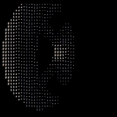

# 🍩 Donut in Python

Welcome to **Donut-in-Python**!  
This is a Python implementation of the legendary ASCII spinning donut, inspired by the classic [donut.c](https://www.a1k0n.net/2011/07/20/donut-math.html) — now reimagined for your terminal!

---

## 🎬 Live Demo

```bash
python donut.py
```
> Watch the magic unfold in your terminal!

---

## 🎞️ See It In Action!



*(If the GIF doesn't play, [download it here](https://github.com/Mubasher-Ahmed-I/Donut-in-Python/raw/main/Assets/Donut.gif) and view locally!)*

---

## 🕹️ Interactive Controls

- **Press `Ctrl+C`** to stop the animation at any time.
- Try modifying the code to change the speed, size, or characters for the donut.
- Challenge: Can you make your donut spin the other way? Or add color?

---

## 🌟 Features

- Pure Python, no dependencies
- Beautiful ASCII donut that animates in your terminal
- Well-commented for learning and tinkering

---

## 📚 How It Works

The magic behind this spinning donut lies in some clever math and trigonometry, which transforms 3D coordinates into a mesmerizing 2D animation using ASCII characters for shading.

*Want to dive deeper?*  
Check out [this legendary blog post](https://www.a1k0n.net/2011/07/20/donut-math.html) for a breakdown of the maths and pseudo-code that make it all possible.

---

## 🛠️ Setup

1. **Clone this repo:**
    ```bash
    git clone https://github.com/Mubasher-Ahmed-I/Donut-in-Python.git
    cd Donut-in-Python
    ```

2. **Run the script:**
    ```bash
    python donut.py
    ```

    *(Requires Python 3)*

---

## 🎨 Customization Ideas

- Change the ASCII characters for different shading effects
- Adjust the donut's size and speed
- Add color with [colorama](https://pypi.org/project/colorama/) or similar libraries
- Try porting to another language!

---

## 🙏 Credits

- **Inspiration:**  
  This project was inspired by [this YouTube video](https://www.youtube.com/watch?v=74FJ8TTMM5E).
- **Maths & Pseudo-code:**  
  [Andy Sloane's blog post](https://www.a1k0n.net/2011/07/20/donut-math.html)
- **Debugging, Help & Python inspiration:**  
  [Denbergvanthijs' Python Gist](https://gist.github.com/Denbergvanthijs/7f6936ca90a683d37216fd80f5750e9c)

---

## 🧑‍💻 Author

- [Mubasher-Ahmed-I](https://github.com/Mubasher-Ahmed-I)

---

Enjoy your spinning donut! 🍩✨  
Feel free to fork, tinker, and share your creative twists!
